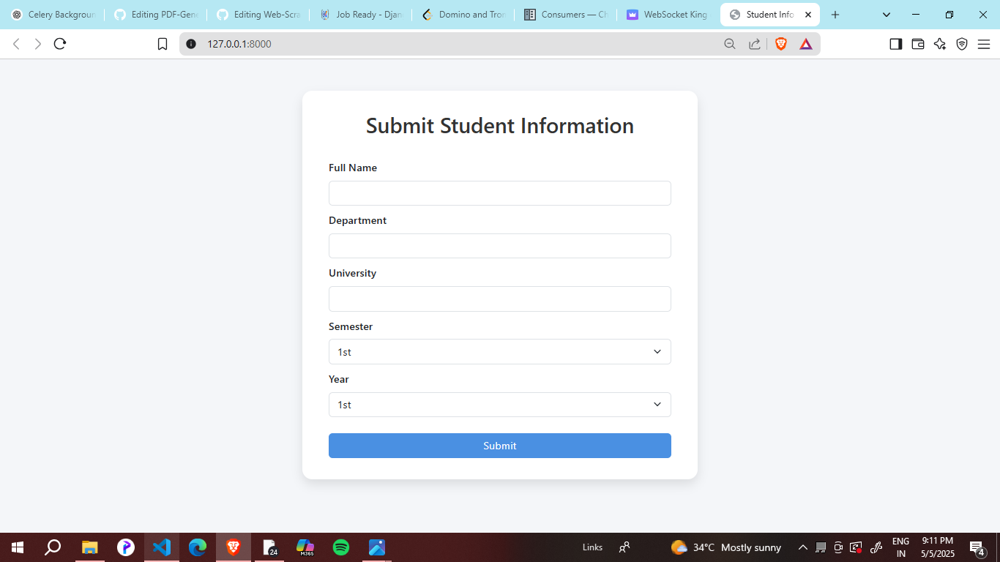
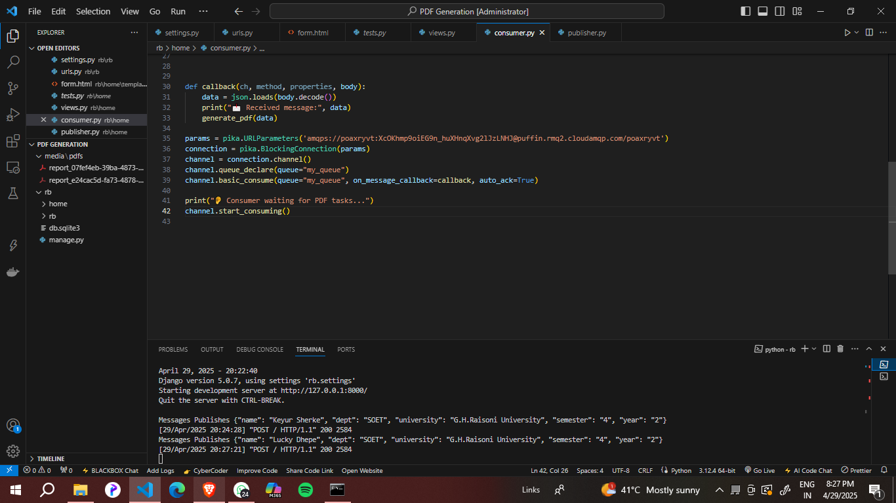
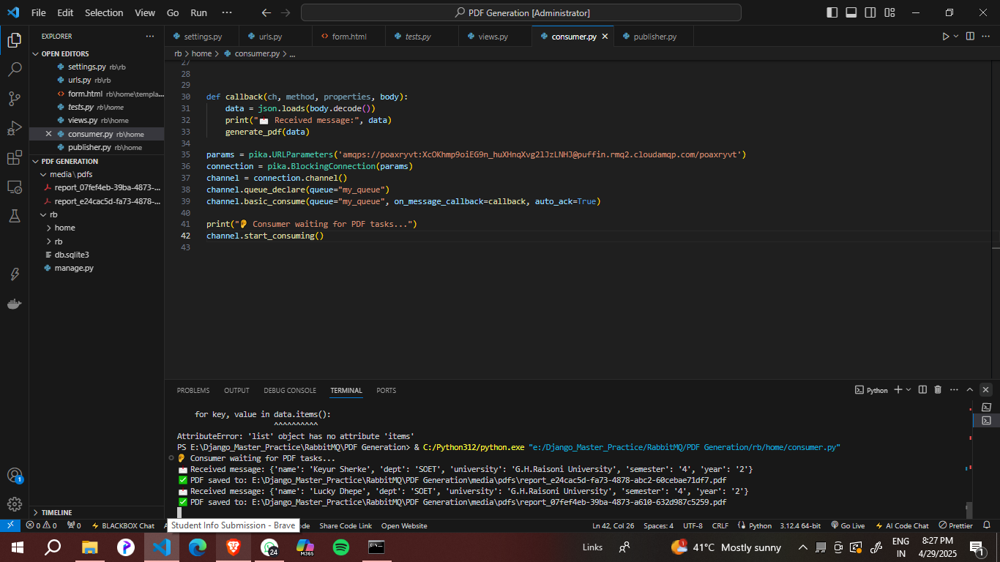

# PDF-Generator-using-RabbitMQ

<h1>PDF-Generator-using-RabbitMQ</h1>
<div class="First Step">
  <h2> 1: Introduction</h2>
  <p>
  This project is a simple yet effective web-based data submission and processing system built using <strong>Django</strong> and <strong>RabbitMQ</strong>. 
  The primary goal of this project is to demonstrate how asynchronous task queues can be integrated into web applications to handle time-consuming operations in the background.
</p>

<p>
  Users submit data such as their <strong>name, department, university, semester, and academic year</strong> through a responsive web interface. 
  Instead of processing this data immediately in the main thread, the system uses RabbitMQ as a message broker to queue the data and process it asynchronously, 
  ensuring a smooth and responsive user experience.
</p>

<p>This setup is particularly useful for handling:</p>
<ul>
  <li>Background processing</li>
  <li>Scalability</li>
  <li>Decoupling of services</li>
  <li>Improved performance and user interaction</li>
</ul>


</div>

<div class="Second Step">
  <h2>📦 2: Preparing Publisher and Consumer for Message Management</h2>

<p>
In this step, we configure a <strong>Publisher</strong> to send messages and a <strong>Consumer</strong> to receive and process them. Messages are transferred through RabbitMQ using the <code>pika</code> library.
</p>

<h3>📤 Publisher</h3>
<p>
The publisher is responsible for sending structured student data to a RabbitMQ queue named <code>my_queue</code>.
</p>

<p><strong>Code:</strong></p>

<pre>
<code>python``
import pika
import random
import json

def publish_message(message):
    params = pika.URLParameters('amqps://your_credentials@your_host/your_vhost')
    connection = pika.BlockingConnection(params)
    channel = connection.channel()
    channel.queue_declare(queue="my_queue")
    
    message = json.dumps(message)
    channel.basic_publish(
        exchange='',
        routing_key="my_queue",
        body=message
    )
    print(f"Message Published: {message}")
    connection.close()
``</code>
</pre>

<p><strong>What it does:</strong></p>
<ul>
  <li>Connects to the RabbitMQ cloud server using <code>pika.URLParameters</code></li>
  <li>Declares a queue <code>my_queue</code> (automatically created if it doesn't exist)</li>
  <li>Serializes the message to JSON and sends it to the queue</li>
  <li>Prints confirmation and closes the connection</li>
</ul>

<h3>📥 Consumer</h3>
<p>
The consumer listens for messages on the same queue and generates a PDF report with the received data using the <code>fpdf</code> library.
</p>

<p><strong>Code:</strong></p>

<pre>
<code>python``
import pika
import json
from fpdf import FPDF
import uuid
import os

def generate_pdf(data):
    pdf = FPDF()
    pdf.add_page()
    pdf.set_font("Arial", size=12)

    pdf.cell(200, 10, txt="Student Information", ln=True, align="C")
    pdf.ln(10)

    for key, value in data.items():
        pdf.cell(200, 10, txt=f"{key.capitalize()}: {value}", ln=True)

    folder_path = os.path.join(os.getcwd(), 'media', 'pdfs')
    if not os.path.exists(folder_path):
        os.makedirs(folder_path)

    filename = f"report_{uuid.uuid4()}.pdf"
    filepath = os.path.join(folder_path, filename)
    pdf.output(filepath)
    print(f"✅ PDF saved to: {filepath}")

def callback(ch, method, properties, body):
    data = json.loads(body.decode())
    print("📩 Received message:", data)
    generate_pdf(data)

params = pika.URLParameters('amqps://your_credentials@your_host/your_vhost')
connection = pika.BlockingConnection(params)
channel = connection.channel()
channel.queue_declare(queue="my_queue")
channel.basic_consume(queue="my_queue", on_message_callback=callback, auto_ack=True)

print("👂 Consumer waiting for PDF tasks...")
channel.start_consuming()
``</code>
</pre>

<p><strong>What it does:</strong></p>
<ul>
  <li>Connects to RabbitMQ and listens on <code>my_queue</code></li>
  <li>When a message is received, it decodes the JSON and prints it</li>
  <li>Calls <code>generate_pdf()</code> to create and save a PDF from the message</li>
</ul>

<p>
This publisher-consumer design ensures that PDF generation runs asynchronously and does not block the user interface or main application flow.
</p>

</div>


<div class="Third Step">
  <h2>🖥️ 3: Handling Form Submission in Django (views.py)</h2>

<p>
This view handles the form data submitted by the user through a web interface. Once the user submits the form, the data is collected and passed to the <code>publish_message</code> function, which sends it to RabbitMQ for background processing.
</p>

<p><strong>Code:</strong></p>

<pre>
<code>python``
from django.shortcuts import render
from .publisher import publish_message

def form_data(request):
    if request.method == 'POST':
        data = {
            "name": request.POST.get("name"),
            "dept": request.POST.get("dept"),
            "university": request.POST.get("university"),
            "semester": request.POST.get("semester"),
            "year": request.POST.get("year"),
        }
        publish_message(data)
        return render(request, 'form.html', {"success": True})

    return render(request, 'form.html')
``</code>
</pre>

<p><strong>What this code does:</strong></p>
<ul>
  <li>Defines a Django view function named <code>form_data</code>.</li>
  <li>Checks if the request method is <code>POST</code> (i.e., form is submitted).</li>
  <li>Retrieves form fields like <code>name</code>, <code>dept</code>, <code>university</code>, <code>semester</code>, and <code>year</code> from the request.</li>
  <li>Packages the data into a Python dictionary.</li>
  <li>Calls the <code>publish_message</code> function to send this data to RabbitMQ for asynchronous processing.</li>
  <li>Returns the <code>form.html</code> template with a <code>success</code> flag if submission is successful.</li>
  <li>If it’s a <code>GET</code> request (i.e., first time loading the form), it simply renders the empty form.</li>
</ul>

<p>
This setup decouples user interaction from heavy tasks like PDF generation and ensures a fast, responsive experience by offloading processing to RabbitMQ.
</p>

</div>

<div class="Fourth Step">
  <h2>🧾 Step 4: Student Information Form (form.html)</h2>

<p>
This is the front-end template where users can input their academic details. It uses Bootstrap 5 for responsive styling and Django templating for secure form submission (e.g., CSRF protection).
</p>

<p><strong>Key Features:</strong></p>
<ul>
  <li>Clean and responsive design using Bootstrap 5</li>
  <li>Fields for Name, Department, University, Semester, and Year</li>
  <li>Dropdowns for selecting semester and year</li>
  <li>CSRF token included for Django's form security</li>
</ul>

<h3>📄 Template Overview:</h3>

```html
  
<!DOCTYPE html>
<html lang="en">
<head>
  <meta charset="UTF-8">
  <title>Student Info Submission</title>
  <link href="https://cdn.jsdelivr.net/npm/bootstrap@5.3.0/dist/css/bootstrap.min.css" rel="stylesheet">
  <style>
    body {
      background: #f4f6f9;
      font-family: 'Segoe UI', Tahoma, Geneva, Verdana, sans-serif;
    }
    .form-container {
      background-color: white;
      padding: 2rem 2.5rem;
      border-radius: 15px;
      box-shadow: 0 8px 16px rgba(0, 0, 0, 0.1);
      max-width: 600px;
      margin: auto;
    }
    h2 {
      color: #333;
      font-weight: 600;
    }
    .form-label {
      margin-top: 10px;
    }
  </style>
</head>
<body>
  <div class="container mt-5">
    <div class="form-container">
      <h2 class="mb-4 text-center">Submit Student Information</h2>
        <form method="POST">
        
        <label class="form-label">Full Name</label>
        <input type="text" class="form-control" name="name" required>

        <label class="form-label">Department</label>
        <input type="text" class="form-control" name="dept" required>

        <label class="form-label">University</label>
        <input type="text" class="form-control" name="university" required>

        <label class="form-label">Semester</label>
        <select class="form-select" name="semester" required>
          <option value="1">1st</option>
          <option value="2">2nd</option>
          <option value="3">3rd</option>
          <option value="4">4th</option>
          <option value="5">5th</option>
          <option value="6">6th</option>
          <option value="7">7th</option>
          <option value="8">8th</option>
        </select>

        <label class="form-label">Year</label>
        <select class="form-select" name="year" required>
          <option value="1">1st</option>
          <option value="2">2nd</option>
          <option value="3">3rd</option>
          <option value="4">4th</option>
          <option value="5">5th</option>
        </select>

        <button type="submit" class="btn btn-primary w-100 mt-4">Submit</button>
      </form>
    </div>
  </div>
</body>
</html>
```

<h3>✅ Explanation:</h3>
<ul>
  <li><code>&lt;form method="POST"&gt;</code>: Sends data via POST method to the Django view.</li>
  <li><code></code>: Provides protection against cross-site request forgery.</li>
  <li>Input fields capture <strong>name</strong>, <strong>department</strong>, <strong>university</strong>.</li>
  <li>Two <code>&lt;select&gt;</code> dropdowns are used for <strong>semester</strong> and <strong>year</strong>.</li>
  <li>The form is styled with CSS and Bootstrap to create a modern and centered layout.</li>
</ul>
 
 <p>4.1.Image of the Form UI</p>
</div>

<div class="Fifth Step">
  <h2>5 : Output</h2>
  
  <p>5.1.The Publisher publishing data</p>

  
  <p>5.2.The Consumer listening to the messages and creating PDF through given data</p>
</div>

<div class="Sixth Step">
  <h2>✅ 6: Conclusion</h2>
<p>
This project demonstrates how to efficiently handle user-submitted data using asynchronous message processing with RabbitMQ and Django. By decoupling the data collection and processing logic, the system ensures smooth performance, better scalability, and an improved user experience. It serves as a practical example of integrating real-time web applications with background task queues to manage long-running operations like PDF generation.
</p>
</div>

